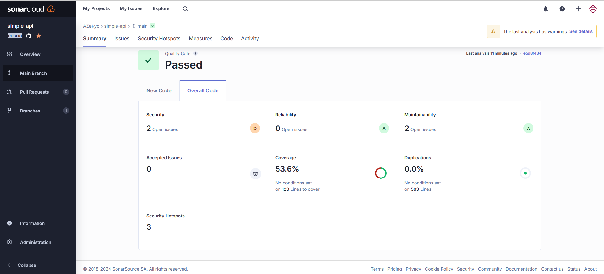

# devops-livecoding

base for GitHub Actions

# Questions

#### What are test containers ?

Java libraries that enable integration testing with lightweight, disposable Docker containers, allowing isolated, reliable tests for dependencies like databases and message queues.

#### Document your GitHub Actions configurations

1. **Workflow Name**: `CI devops 2024`
    - The workflow name is displayed in GitHub Actions for easy identification.

2. **Trigger Conditions** (`on`):
    - **Push Events**: The workflow is triggered on pushes to the `main` and `develop` branches.
    - **Pull Requests**: It also runs on every pull request to ensure the code is up to quality standards before merging.

3. **Job Definition** (`jobs`):
    - **Job Name**: `test-backend`
        - **Runs-On**: The job runs on an `ubuntu-22.04` environment.

4. **Job Steps** (`steps`):
    - **Checkout Repository**: Uses `actions/checkout@v2.5.0` to clone the repository, making the code accessible within the workflow.
    - **Set Up JDK 17**: Uses the `actions/setup-java@v3` action to install JDK 17 with the Amazon Corretto distribution, which is compatible with many Java applications.
    - **Build and Test with Maven**: Executes `mvn clean verify` in the `simple-api` directory to build the project and run tests.


#### For what purpose do we need to push docker images ?

Pushing Docker images allows for easy deployment across environments, ensures version control, and facilitates collaboration among team members by providing a consistent application environment.

#### Document your quality gate configuration



## Quality Gate Status

| Metric           | Status       | Details                           |
|------------------|--------------|-----------------------------------|
| **Quality Gate** | Passed ✅    | Meets configured quality criteria |

## Code Quality Metrics

- **Security**:
   - **2** Open issues
   - **3** Security hotspots

- **Reliability**:
   - **0** Open issues
   - **Rating**: D

- **Maintainability**:
   - **2** Open issues
   - **Rating**: A

- **Coverage**:
   - **53.6%** of code covered by tests
   - **123** lines are set for coverage conditions

- **Duplications**:
   - **0.0%** code duplication
   - **583** lines analyzed for duplication
  
---------------------
--------------------

## TP N°3 ANSIBLE

## Document your inventories and base commands

This inventory file defines a YAML-based structure for managing host configurations in Ansible. It includes:

1. **All Hosts Group**: Defines variables that apply to all hosts.
2. **Children Groups**: Subgroups of hosts categorized under different environments (e.g., production).

### Inventory Content

```yaml
all:
  vars:
    ansible_user: admin
    ansible_ssh_private_key_file: /home/victor/id_rsa
  children:
    prod:
      hosts:
        victor.gaspard.takima.cloud
```
### Explanation of Key Components

- **`all`**: This top-level group includes all hosts and can define global variables applicable to all child groups.
  
- **`vars`**: Variables defined here will be applied to all hosts in this inventory.
  - **`ansible_user`**: The SSH user used to connect to the hosts.
  - **`ansible_ssh_private_key_file`**: The path to the private key used for SSH authentication.

- **`children`**: This section categorizes hosts into different environments or groups.
  
- **`prod`**: A child group representing the production environment.
  - **`hosts`**: Lists the hosts in this group. Here it contains `victor.gaspard.takima.cloud`.

Use the command `ansible all -i inventories/setup.yml -m setup -a "filter=ansible_distribution*"` to gather and display facts related to the distribution of all hosts defined in the specified inventory file.

## Document your playbook

## Tasks

All the tasks are in main.yml. In playbook.yml only remains the indication of the roles in docker.

### 1. Install Required Packages

```yaml
- name: Install required packages
  apt:
    name:
      - apt-transport-https
      - ca-certificates
      - curl
      - gnupg
      - lsb-release
      - python3-venv
    state: latest
    update_cache: yes
```
This task ensures that essential packages for Docker installation and secure connections are installed.

### 2. Add Docker’s Official GPG Key

```yaml
- name: Add Docker GPG key
  apt_key:
    url: https://download.docker.com/linux/debian/gpg
    state: present
```
This task adds the GPG key necessary for verifying Docker packages.

### 3. Set Up the Docker Stable Repository

```yaml
- name: Add Docker APT repository
  apt_repository:
    repo: "deb [arch=amd64] https://download.docker.com/linux/debian {{ ansible_facts['distribution_release'] }} stable"
    state: present
    update_cache: yes
```
This task configures the APT repository for Docker to ensure the latest version is installed.

### 4. Install Docker

```yaml
- name: Install Docker
  apt:
    name: docker-ce
    state: present
```
This task installs Docker Community Edition.

### 5. Install Python3 and pip3

```yaml
- name: Install Python3 and pip3
  apt:
    name:
      - python3
      - python3-pip
    state: present
```
This task ensures that Python3 and pip3 are installed for managing Python packages.

### 6. Create a Virtual Environment for Python Packages

```yaml
- name: Create a virtual environment for Docker SDK
  command: python3 -m venv /opt/docker_venv
  args:
    creates: /opt/docker_venv  # Only runs if this directory doesn’t exist
```
This task creates a virtual environment to isolate Python packages.

### 7. Install Docker SDK for Python in the Virtual Environment

```yaml
- name: Install Docker SDK for Python in virtual environment
  command: /opt/docker_venv/bin/pip install docker
```
This task installs the Docker SDK for Python within the created virtual environment.

### 8. Ensure Docker is Running

```yaml
- name: Make sure Docker is running
  service:
    name: docker
    state: started
  tags: docker
```
This task ensures that the Docker service is started and running.

## Document your docker_container tasks configuration

1. Install docker and its dependencies

```yml
---
# Install prerequisites for Docker
- name: Install required packages
  apt:
    name:
      - apt-transport-https
      - ca-certificates
      - curl
      - gnupg
      - lsb-release
      - python3-venv
    state: latest
    update_cache: yes

# Add Docker’s official GPG key
- name: Add Docker GPG key
  apt_key:
    url: https://download.docker.com/linux/debian/gpg
    state: present

# Set up the Docker stable repository
- name: Add Docker APT repository
  apt_repository:
    repo: "deb [arch=amd64] https://download.docker.com/linux/debian {{ ansible_facts['distribution_release'] }} stable"
    state: present
    update_cache: yes

# Install Docker
- name: Install Docker
  apt:
    name: docker-ce
    state: present

# Install Python3 and pip3
- name: Install Python3 and pip3
  apt:
    name:
      - python3
      - python3-pip
    state: present

# Create a virtual environment for Python packages
- name: Create a virtual environment for Docker SDK
  command: python3 -m venv /opt/docker_venv
  args:
    creates: /opt/docker_venv  # Only runs if this directory doesn’t exist

# Install Docker SDK for Python in the virtual environment
- name: Install Docker SDK for Python in virtual environment
  command: /opt/docker_venv/bin/pip install docker

# Ensure Docker is running
- name: Ensure Docker is running
  service:
    name: docker
    state: started
  tags: docker
```


2. Create docker network

```yml
- name: Create Docker network
  community.docker.docker_network:
    name: my-network
    state: present
```


3. Launch database

```yml
- name: Run Database
  community.docker.docker_container:
    name: my-db
    image: azekyo/tp-devops-database
    env:
      POSTGRES_DB: db
      POSTGRES_USER: user
      POSTGRES_PASSWORD: pwd
    networks:
      - name: my-network
    volumes:
      - db-volume:/var/lib/postgresql/data
    state: started
```


4. Launch application

```yml
- name: Run Backend Application
  community.docker.docker_container:
    name: my-api
    image: azekyo/tp-devops-api	
    env:
      DATABASE_HOST: my-db  # Name of the database container
      DATABASE_PORT: "5432"  # Default PostgreSQL port
      POSTGRES_DB: db
      POSTGRES_USER: user
      POSTGRES_PASSWORD: pwd
    networks:
      - name: my-network
    state: started
```


5. Launch proxy

```yml
- name: Run Proxy
  community.docker.docker_container:
    name: httpd
    image: azekyo/tp-devops-httpd	
    ports:
      - "80:80"
    networks:
      - name: my-network
    state: started
```


6. Run the playbook


```bash
ansible-playbook -i inventories/setup.yml playbook.yml
```


